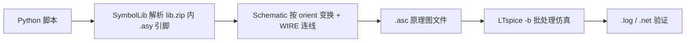

# ltspice-schematic

> 用代码生成 LTspice 原理图（`.asc`），并自动批处理仿真验证。

这是一个 [Claude Skill](https://code.claude.com/docs/en/skills)（同样适用于 VS Code Copilot 等 Agent 的 Skill 规范），教 Agent **用纯 Python 脚本生成可在 LTspice 中直接打开、可仿真的原理图文件**——无需手工 GUI 拖拽，也无需停留在只有网表的 `.cir`。

## 特性

- **代码即电路图**：`.asc` 本质是纯文本，脚本用 `WIRE`/`SYMBOL`/`FLAG`/`TEXT` 描述整张图纸
- **自动解析符号引脚**：直接读取 LTspice 安装目录 `lib.zip` 内的 `.asy` 符号文件，按放置方向（`R0`–`R270` + 镜像）变换引脚坐标，**告别手算坐标**
- **完整可仿真**：支持网络标签、接地、SPICE 指令（`.tran` / `.ac` / `.op` / `.dc`）、信号源取值（SINE / PULSE / PWL / EXP）
- **可验证**：配合 `LTspice.exe -b` 批处理仿真，读 `.log` / `.net` 确认电路拓扑正确
- **附带格式参考**：`references/asc_format.md` 收录 `.asc`/`.asy` 语法、方向变换表、常用元件引脚速查与排错指南

## 目录结构

```
ltspice-schematic/
├── SKILL.md                    # Skill 定义（工作流、规则、资源索引）
├── README.md
├── LICENSE
├── references/
│   └── asc_format.md           # .asc / .asy 格式参考与排错指南
└── scripts/
    ├── ltspice_builder.py      # 生成器库：Schematic / SymbolLib
    └── example_rc.py           # RC 充电电路完整示例（可直接当模板）
```

## 环境要求

| 依赖 | 说明 |
|---|---|
| Python 3.8+ | 仅标准库，无第三方依赖 |
| [LTspice](https://www.analog.com/en/resources/design-tools-and-calculators/ltspice-simulator.html) | 24.x（新版，`lib.zip` 打包符号库）；17.x 旧版路径亦已兼容 |
| Windows | 自动定位逻辑按 Windows 安装路径编写 |

## 快速开始

```bash
cd scripts
python example_rc.py            # 生成 rc_charge.asc（当前目录）
python example_rc.py D:/out     # 或指定输出目录
```

然后用 LTspice 打开 `rc_charge.asc`，或直接批处理仿真：

```bash
LTspice.exe -b rc_charge.asc    # 退出码 0 且 .log 出现 ... succeeded 即验证通过
```

示例电路：5V 直流源经 1kΩ 给 1µF 电容充电，时间常数 τ = RC = 1ms，`.tran 10m` 可看到电容电压充到 5V。

## 自己写一个电路

复制 `scripts/example_rc.py` 为新脚本（与 `ltspice_builder.py` 同目录即可直接 `import`），核心 API 只有几行：

```python
from ltspice_builder import Schematic, SymbolLib

lib = SymbolLib()                    # 自动定位 LTspice 的 lib.zip
sch = Schematic()

# 放元件：名称、图纸坐标、方向、编号、数值；windows= 显式定位文字（横放元件必需）
v1 = sch.symbol(lib, "voltage", 96, 144, "R0", inst="V1", value="5")
r1 = sch.symbol(lib, "res", 304, 144, "R90", inst="R1", value="1k")

# 连线一律用 s.pins 给出的引脚绝对坐标，不要手算
sch.wire(*v1.pins[0], *r1.pins[1])
sch.ground(192, 256)                 # FLAG x y 0
sch.spice_text(48, 320, ".tran 10m")
sch.save("my_circuit.asc")
```

## 核心规则

1. **不要手算引脚坐标**——一律取 `sch.symbol(...).pins`（已含旋转/镜像变换）
2. `WIRE` 端点必须与引脚坐标**完全相等**；坐标取 16 的倍数；引脚坐标重合即自动相连
3. 横放元件（`R90`/`R270`）默认文字会竖排重叠，需用 `windows=` 显式定位编号（窗口 0）和数值（窗口 3）
4. 接地没有独立符号，用 `sch.ground(x, y)`（即 `FLAG x y 0`）
5. 电路正确性以 `LTspice.exe -b` 退出码与 `.net` 网表为准

更多细节见 [`SKILL.md`](SKILL.md) 与 [`references/asc_format.md`](references/asc_format.md)。

## 工作原理



## 适用与不适用

- ✅ 把文字/作业描述的电路（RC/RLC 滤波、分压、整流滤波、LED 驱动、三极管/MOS 开关与放大、555 振荡等）变成可仿真的原理图
- ✅ 程序化、批量生成电路图
- ❌ 手工 GUI 拖拽编辑
- ❌ 只生成无原理图的 `.cir` 网表

## 许可证

[MIT](LICENSE)
